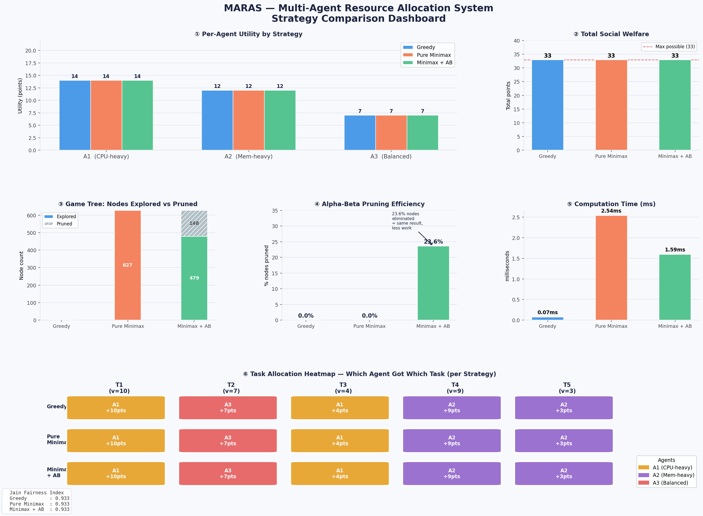

# MARAS 🤖⚔️
### Multi-Agent Resource Allocation using Adversarial Search & Classical Planning


---

## 📌 Overview

**MARAS** is a multi-agent simulation where three competing agents allocate resources across five tasks using a combination of:

- 🧠 **STRIPS-based Classical Planning** — agents generate valid action sequences using preconditions and effects
- ♟️ **Minimax Search** — adversarial decision-making to maximize an agent's utility while minimizing opponents'
- ✂️ **Alpha-Beta Pruning** — efficient tree search by eliminating suboptimal branches

The core insight demonstrated by this project: **STRIPS planning reduces the effective branching factor**, making adversarial search significantly faster and more scalable.

---

## 🏗️ Project Structure

```
MARAS/
│
├── main.py               # Entry point — runs all comparison modes
├── agent.py              # Agent class with strategy selection logic
├── environment.py        # Shared environment, resources, and task definitions
├── minimax.py            # Minimax and Alpha-Beta pruning implementations
├── planner.py            # STRIPS planning engine (preconditions, effects, goals)
├── simulation.py         # Simulation loop and multi-agent interaction manager
├── comparison.py         # Benchmarks four modes and collects metrics
└── MARAS_visualization.png  # Output visualization of results
```

---

## ⚙️ How It Works

### Environment
- **3 Agents** compete simultaneously for shared resources
- **5 Tasks** each with preconditions, resource costs, and utility values
- Agents take turns; each decision impacts the global resource state

### Four Comparison Modes

| Mode | Description |
|------|-------------|
| **Minimax Only** | Pure adversarial search with no planning layer |
| **Alpha-Beta Only** | Pruned adversarial search, no planning layer |
| **STRIPS + Minimax** | Planning filters valid actions before Minimax |
| **STRIPS + Alpha-Beta** | Planning filters valid actions before Alpha-Beta *(most efficient)* |

### STRIPS Planning
Each action is defined with:
- **Preconditions** — what must be true before execution
- **Effects** — how the world state changes after execution
- **Goals** — what the agent is trying to achieve

The planner generates a valid sequence of actions, which is then passed to the adversarial search to select the optimal move.

---

## 📊 Results



The visualization compares nodes explored, time taken, and scores across all four modes — demonstrating the efficiency gains from combining planning with adversarial search.

---

## 🚀 Getting Started

### Prerequisites
```bash
Python 3.8+
```

### Installation
```bash
git clone https://github.com/Viraj5138/MARAS.git
cd MARAS
```

### Run
```bash
python main.py
```

To run a specific comparison mode, refer to `comparison.py` for individual mode functions.

---

## 🧪 Key Concepts

| Concept | Role in MARAS |
|--------|----------------|
| **Minimax** | Finds optimal move assuming adversarial opponents |
| **Alpha-Beta Pruning** | Skips branches that can't affect the final decision |
| **STRIPS Planning** | Reduces search space to only valid, goal-directed actions |
| **Branching Factor** | Reduced significantly when STRIPS filters the action space |

---

## 📚 References

- Russell & Norvig — *Artificial Intelligence: A Modern Approach*
- Fikes & Nilsson (1971) — *STRIPS: A New Approach to the Application of Theorem Proving*
- NPTEL — *Fundamentals of Artificial Intelligence* (IIT Guwahati)

---

## 👤 Author

**Viraj** — [@Viraj5138](https://github.com/Viraj5138)

---

> *Built as part of an academic exploration into combining classical planning with adversarial search in multi-agent environments.*
